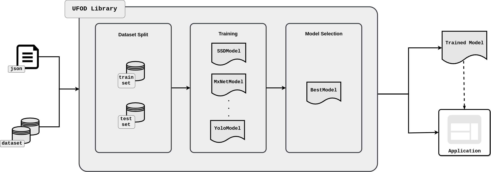
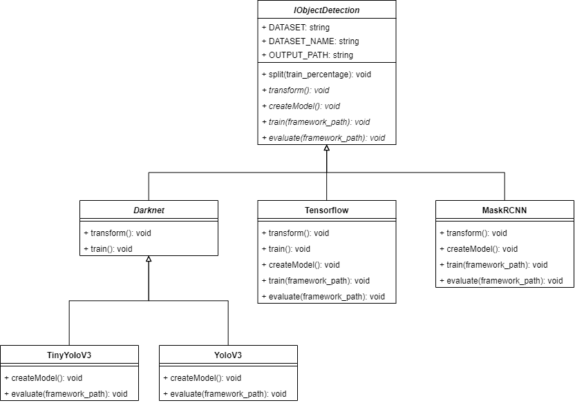
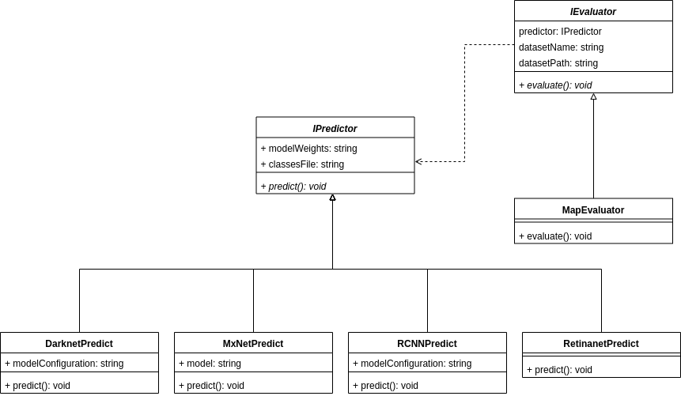
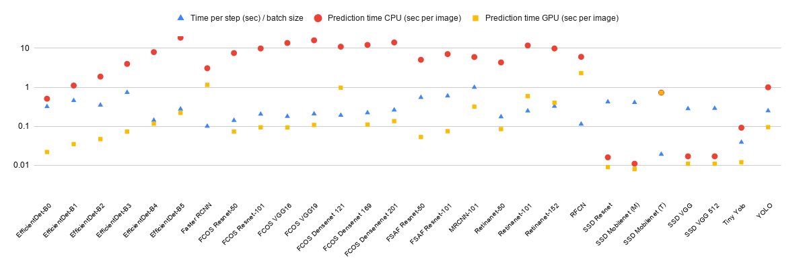

# UFOD: A Unified Framework for Object Detection

UFOD is an open-source framework that enables the training and comparison of object detection models on 
custom datasets using different underlying frameworks and libraries. Currently, the most well-known object detection 
frameworks have been included in UFOD, and new tools can be easily incorporated thanks to UFOD's high-level API.

## Information about UFOD

1. [Workflow of the UFOD framework](#workflow-of-the-ufod-framework)
2. [List of frameworks and libraries supported in UFOD](#list-of-frameworks-and-libraries-supported-in-ufod)
3. [Using UFOD](#using-ufod)
   * [Dependencies and installation](#dependencies-and-installation)
   * [Dataset](#dataset)
   * [Configuration](#configuration-file)
   * [How to launch the training process](#how-to-launch-the-training-process)
4. [Extending UFOD](#adding-new-models)
   * [Adding new frameworks and algorithms](#adding-new-frameworks-and-algorithms)
   * [Adding new evaluation metrics](#adding-new-evaluation-metrics)
5. [Experiments](#experiments)
   * [Performance of different algorithms](#performance-of-different-algorithms)
   * [Speed of different algorithms](#speed-of-different-algorithms)
6. [Acknowledgements](#acknowledgements)

### Workflow of the UFOD framework

The workflow of UFOD, depicted in the following image, captures all the necessary steps to train several object detection 
models and select the best one. Such a workflow can be summarised as follows. First of all, the user selects the dataset 
of images and some configuration parameters (mainly, the algorithms that will be trained and the frameworks or libraries 
that provide them). Subsequently, UFOD splits the dataset into a training set and a testing set. The training set is
employed to construct several object detection models, and the best of those models is selected based on their 
performance on the testing set. The output of the framework is the best model, and an application, in the form of a
Jupyter notebook, to employ such a model. Apart from the first step --- that is, the selection of the models to be 
trained --- the rest of the process is conducted automatically by UFOD without any user intervention. 
A more detailed explanation of the main features of this framework can be found in our [draft paper](draft.pdf).





### List of frameworks and libraries supported in UFOD

Currently, UFOD provides support for the following algorithms.


| Framework/Library | Algorithms supported | Backbones |
|---------|----------------------|----------------------|
| [Darknet](https://pjreddie.com/darknet/yolo/) | YOLO | Darknet 53 |
| | Tiny YOLO | Darknet 8|
| [MXNet](https://gluon-cv.mxnet.io/)   | SSD  | VGG16, Mobilenet, Resnet 50 | 
| [Tensorflow](https://github.com/tensorflow/models/tree/master/research/object_detection) | Faster-RCNN | Inception v2 |
|  | SSD | Mobilenet v2 |
|  | RFCN | Resnet 101 |
| [RetinaNet for Keras](https://github.com/fizyr/keras-retinanet) | RetinaNet | Resnet 50, Resnet 101 |
| [MaskRCNN for Keras](https://github.com/matterport/Mask_RCNN) | Mask RCNN | Resnet 50, Resnet 101 |
| [EfficientDet for Keras](https://github.com/joheras/EfficientDet) | EfficientDet | Efficientnet B0, B1, B2, B3, B4, B5 |
| [FCOS for Keras](https://github.com/joheras/keras-fcos) | FCOS | Resnet 50, Resnet 101, VGG16, VGG19, Densenet 121, 169, 201 |
| [FSAF for Keras](https://github.com/joheras/FSAF) | FSAF | Resnet 50, Resnet 101 |

## Using UFOD

### Dependencies and installation
To install UFOD it is necessary to execute the following commands:

```bash
git clone --recursive https://github.com/ManuGar/UFOD.git
cd UFOD
pip3 install -r requirements.txt
cd map
make
```

### Dataset

The dataset needs to be annotated using the Pascal VOC format. An application that produces such a format is [LabelImg](https://github.com/tzutalin/labelImg). The folder containing the dataset must contain two folders:
- JPEGImages folder: containing the images. 
- Annotations folder: containing the annotations using the Pascal format. 

This dataset will be later split. If the user wants to provide a explicit split, the organisation must be as follows:
- train
  - JPEGImages: folder containing the images of the training set. 
  - Annotations: folder containing the annotations of the training set. 
- test
  - JPEGImages: folder containing the images of the testing set. 
  - Annotations: folder containing the annotations of the testing set. 

A dataset with this organization is provided in the [fruits folder](fruit).


### Configuration File

UFOD training process is configured by means of a json file, that must contain the following information:

- "dataset": path to the dataset of images. 
- "dataset_name": a name to the dataset.
- "exec": the execution mode. There are two execution modes:
  - "local". The training process is run locally. In this option it is necessary to provide the number of available gpus with the "ngpus" parameter. 
  - "slurm". The training process is run in a cluster with SLURM. There are several parameters to configure in this option, such as the execution time ("time" parameter), the partition ("partition" parameter), the gres ("gres" parameter), the memory ("mem" parameter), or the number of gpus  ("ngpus" parameter).
- "frameworks": the list of models to train. Currently, the following options are available:
  - ["Mxnet","ssdVgg16"]: SSD with the VGG16 backbone of the MXNet framework. 
  - ["Mxnet","ssdVgg16_512"]: SSD with the VGG16 backbone and image size of 512 of the MXNet framework. 
  - ["Mxnet","ssdResnet"]: SSD with the Resnet backbone of the MXNet framework.
  - ["Mxnet","ssdMobilenet"]: SSD with the mobilenet backbone of the MXNet framework.
  - ["Rcnn","mask-rcnn"]: Mask-RCNN algorithm using a Keras library. 
  - ["Darknet","yolo"]: YOLO with the Darknet framework.
  - ["Darknet","tinyYolo"]: TinyYOLO with the Darknet framework.
  - ["Retinanet","retinanet"]: RetinaNet algorithm using a Keras library. 
  - ["Tensorflow", "ssdInception"]: SSD with the inception backbone using the Tensorflow framework.
  - ["Tensorflow", "fasterRcnnResnet"]: Faster RCNN with the inception backbone using the Tensorflow framework.
  - ["Tensorflow", "rfcnResnet"]: RFCN with the inception backbone using the Tensorflow framework.
  - ["Tensorflow", "maskRcnnInception"]: Mask RCNN with the inception backbone using the Tensorflow framework.
  - ["Efficientdet", "0"]: EfficientDet with EfficientNet 0 backbone.
  - ["Efficientdet", "1"]: EfficientDet with EfficientNet 1 backbone.
  - ["Efficientdet", "2"]: EfficientDet with EfficientNet 2 backbone.
  - ["Efficientdet", "3"]: EfficientDet with EfficientNet 3 backbone.
  - ["Efficientdet", "4"]: EfficientDet with EfficientNet 4 backbone.
  - ["Efficientdet", "5"]: EfficientDet with EfficientNet 5 backbone.
  - ["FCOS", "resnet50"]: FCOS with resnet50 backbone.
  - ["FCOS", "resnet101"]: FCOS with Resnet101 backbone.
  - ["FCOS", "vgg16"]: FCOS with vgg16 backbone.
  - ["FCOS", "vgg19"]: FCOS with vgg19 backbone.
  - ["FCOS", "densenet121"]: FCOS densenet121 resnet50 backbone.
  - ["FCOS", "densenet169"]: FCOS with densenet169 backbone.
  - ["FCOS", "densenet201"]: FCOS with densenet201 backbone.
  - ["FSAF", "resnet50"]: FSAF with resnet50 backbone.
  - ["FSAF", "resnet101"]: FSAF with Resnet101 backbone.
  
Examples of this configurations files can be seen in the [Optic.json](Optic.json) (local execution) and the [prueba.json](prueba.json) (cluster execution) files.


### How to launch the training process

Once the user has prepared the dataset and fixed the training options in the ```config.json``` file, the training process is launched using the following command:

```bash
python3 taskLauncher.py -c config.json
```

## Extending UFOD

UFOD has been designed to be easily extensible to incorporate new frameworks and algorithms. 

### Adding new frameworks and algorithms

UFOD has been designed to easily include new frameworks and object detection algorithms on it. To this aim, it is necessary to 
implement a new class. This process can be summarised as follows. Independently of the deep learning framework and algorithm used, the procedure to train an object detection model consists of the following steps: 

1. Organise the dataset using a particular folder structure;
2. Transform the annotations of the dataset to the correct format;
3. Create the necessary configuration files; and
4. Launch the training process. 

Steps 1, 2 and 4 are framework operations, since all the models of a framework require the same folder structure, annotation format, and their training process is launched in the same way; whereas, Step 3 depends on the concrete model. These steps have been modelled using an abstract class called ```IObjectDetection``` (see the following class diagram), that is particularised for each concrete framework and model. To be more concrete, for each framework that provides several detection algorithms, an abstract class providing the functionality for Steps 1, 2 and 4 is implemented (see, for instance, the class Darknet in the figure below); in addition, such a class is extended with subclasses for each individual model implementing the functionality for Step 3 (see the classes Tiny YOLOV3 and YOLOV3). In the case, of libraries that implement a single algorithm, a class with all the methods must be created (see, for instance, the class RetinaNet the below figure). Including a new framework or library in UFOD is as simple as defining a new class that extends ```IObjectDetection```. You can see examples of the implementations of these classes in the [objectDetectors](objectDetectors) folder of this repository. Once the class for the new framework/algorithm is defined, it is necessary to include it in the [factoryModel.py](factoryModel.py) file to facilitate its use. 



### Adding new evaluation metrics 

Each framework is able to compute the performance of their models; however, different frameworks employ different evaluation metrics; and, therefore, it is difficult to compare the models produced with different tools. To deal with this problem in UFOD, we have included a procedure to evaluate algorithms independently of the underlying framework. Such a procedure is a two-step process that can be summarised as follows. Given a folder with the images and annotations that will be employed for testing a model:

1. The model detects the objects in those images and stores the result in the Pascal VOC format inside the same folder; and
2. the original annotations and the generated detections are compared with a particular metric. 

This two-step process has been modelled in the UFOD API (see the figure below) using the abstract class ```IPredictor``` to implement the first step --- this class is particularised for each framework since all the models of the same framework perform predictions in the same way --- and the abstract class ```IEvaluator``` to implement the second step --- this class is particularised with different evaluation metric; and, currently, metrics such as the mAP, the IoU or the F1-score are supported. Using this approach, the models constructed using the UFOD framework can be compared even if they were constructed using different frameworks. Moreover, this part of the UFOD API can be employed to compare models constructed outside the framework by using a common metric. 



## Experiments

### Perfomance of different algorithms

We have tested UFOD with several detection algorithms and datasets. Here, we include the results for the [Optic Disc dataset]() and the [Reconyx dataset]().


### Speed of different algorithms

We have also evaluated the speed of the different algorithms in terms of training time, prediction time using GPUs, and prediction time using CPUs. All the experiments were conducted using Colab notebooks (2-core Xeon 2.3GHz, 13GB RAM, 33GB HDD, GPU Tesla P100).




## Acknowledgments

This work was partially supported by Ministerio de Economía y Competitividad [MTM2017-88804-P], Agencia de Desarrollo 
Económico de La Rioja [2017-I-IDD-00018], a FPI grant from Community of La Rioja 2018 and the computing facilities of
Extremadura Research Centre for Advanced Technologies (CETA-CIEMAT), funded by the European Regional Development Fund 
(ERDF). CETA-CIEMAT belongs to CIEMAT and the Government of Spain.
